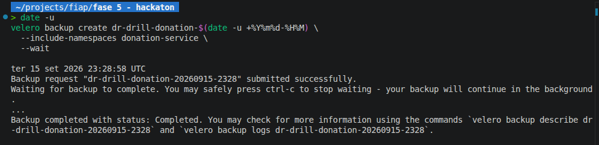
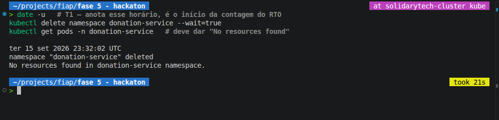
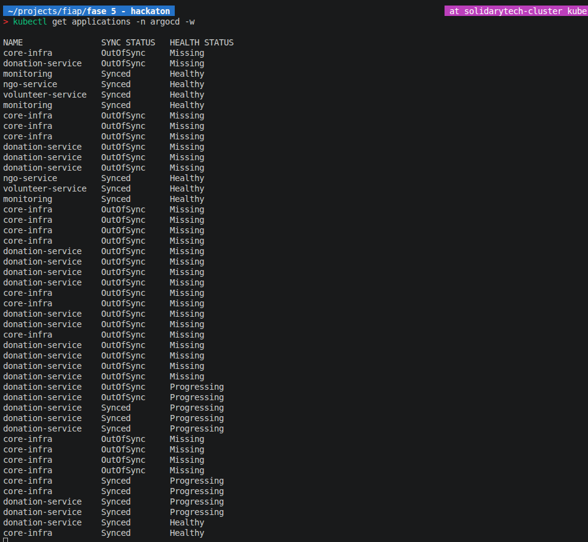
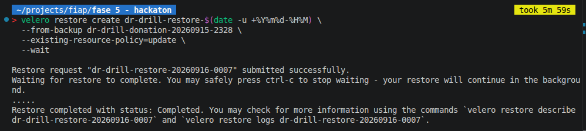
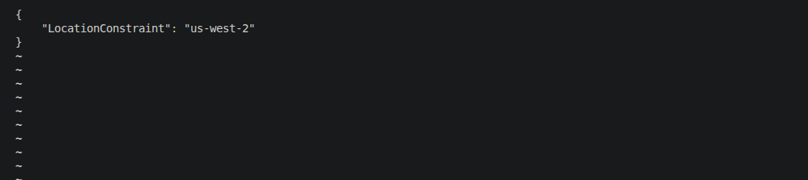
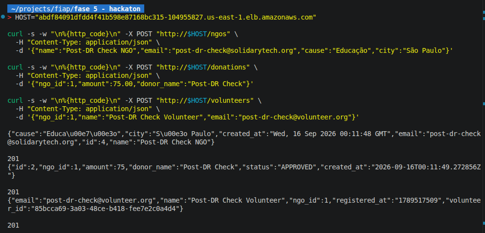

# Plano de Continuidade de Negócios (PCN) — SolidaryTech

**Documento executivo** — para a diretoria da SolidaryTech e para o relatório de entrega do Hackathon Fase 5 (item 4 — Multicloud, Segurança e Disaster Recovery).

## 1. Contexto e criticidade

A plataforma SolidaryTech conecta ONGs, doadores e voluntários. O `donation-service` é o **caminho crítico** do negócio: se ele para, doações reais deixam de ser processadas — impacto direto em receita e em confiança das ONGs parceiras. Os outros dois serviços (`ngo-service`, `volunteer-service`) são importantes, mas uma indisponibilidade temporária neles não interrompe o fluxo financeiro.

## 2. Objetivos de Recuperação

| Componente | RTO (tempo máximo de recuperação) | RPO (perda máxima de dados) | Justificativa |
|---|---|---|---|
| `donation-service` (app + estado do cluster) | **1 hora** | **24 horas** (backup diário do Velero, 03:00 UTC) | O deployment é stateless e reconstruível via GitOps (ArgoCD) em minutos; o RTO de 1h dá margem para diagnóstico + restore manual do Velero se o cluster inteiro precisar ser recriado. |
| Dados de doações (RDS `donation-service-db`) | **1 hora** (tempo de restore de snapshot) | **24 horas** (backup automático diário do RDS, retenção de 7 dias) | Backup automático nativo do RDS, independente do cluster Kubernetes — mesmo que o EKS caia por completo, os dados de doação sobrevivem. |
| `ngo-service` / `volunteer-service` | 4 horas | 24 horas | Não bloqueiam o fluxo de doação; prioridade menor no runbook de incidentes. |
| Observabilidade (Prometheus/Loki/Grafana) | Best-effort (não crítico) | N/A — dados de telemetria, não de negócio | Armazenamento `emptyDir` (efêmero) por decisão de custo; perda de histórico de métricas em caso de falha do cluster é aceitável, não perda de dados de negócio. |

**Por que esses números e não "o mais rápido possível":** RTO/RPO frouxos demais (ex: 24h/24h para tudo) não seriam credíveis para um caminho crítico financeiro; RTO/RPO agressivos demais (ex: minutos) exigiriam multi-região ativo-ativo, fora do escopo e do orçamento de uma ONG e incompatível com as restrições do AWS Academy Learner Lab (sem IAM roles customizadas, sessões efêmeras). Os valores acima refletem o meio-termo defensável: dados financeiros protegidos com um RPO de 1 dia (aceitável para uma plataforma de doações, que não é um sistema de pagamento em tempo real regulado) e um RTO de 1h sustentado por automação (GitOps + backups), não por intervenção manual lenta.

## 3. Estratégia de DR — Opção A: Cross-Region Backup (Velero)

- **Velero** faz backup do estado do cluster Kubernetes (manifests, Secrets, ConfigMaps — não há PersistentVolumes stateful no cluster hoje) para um bucket S3 **em `us-west-2`**, região diferente do cluster principal (`us-east-1`). Ver `terraform/production/dr.tf`.
- Agendamento: backup diário do namespace `donation-service` (03:00 UTC, retenção 30 dias) + backup semanal do cluster inteiro.
- **Dados de doação em si** (RDS Postgres) são protegidos separadamente por backup automático nativo do RDS (retenção 7 dias) — Velero não cobre bancos de dados gerenciados, só o estado do Kubernetes. Essa combinação (Velero + RDS automated backups) é o que efetivamente protege tanto a infraestrutura quanto os dados do hot path.
- **Teste de restore (drill completo já executado)**: backup manual via `velero backup create`, deleção real do namespace `donation-service` em produção, e observação da recuperação — o ArgoCD `selfHeal` reconciliou o namespace/deployments em **~70-90s**, muito abaixo do RTO de 1h documentado acima; em seguida `velero restore create --from-backup ... --wait` foi executado para validar o caminho de restore Velero de ponta a ponta (`Completed`, 18/18 itens), e os endpoints (`/ngos`, `/donations`, `/volunteers/<ngo_id>`) foram revalidados após a recuperação, confirmando que os dados no RDS não foram afetados durante o drill.

  📸 **Evidência visual:** _(inserir screenshot antes da entrega)_
  

## 4. Fluxo de recuperação (resumo operacional)

1. **Cluster/região principal indisponível** → equipe aciona o playbook de DR.
2. **Infraestrutura**: `terraform apply` recria VPC/EKS/RDS/ECR (o Terraform é declarativo e idempotente — módulos já provisionam tudo do zero se necessário).
3. **Estado do cluster**: `velero restore create --from-backup <último-backup-donation-service>` restaura namespaces/manifests a partir do bucket em `us-west-2`.
4. **Dados**: se o RDS também precisar ser recriado, restore a partir do snapshot automático mais recente (RPO de até 24h).
5. **GitOps**: ArgoCD re-sincroniza automaticamente assim que o cluster estiver de pé e apontado para o repositório — não há passo manual de redeploy de aplicação.

## 5. Limitações conhecidas (transparência para a diretoria)

- Ambiente roda em **AWS Academy Learner Lab** — credenciais efêmeras (sessões de ~4h) tornam um DR real (não só simulado) operacionalmente inviável fora de uma janela de demonstração. Em produção real, a recomendação é migrar para uma conta AWS própria com credenciais de longa duração e IAM roles dedicadas (IRSA), o que também destravaria criptografia/backup mais robustos.
- Não há warm-standby (Opção B do edital): o RTO de 1h assume que a reconstrução via Terraform + Velero é aceitável; um RTO menor exigiria um ambiente espelho já no ar, com custo contínuo dobrado — decisão consciente de custo-benefício para o estágio atual do projeto.

## 6. Evidências visuais

> Capturas de tela do drill de DR executado nesta entrega. Substituir os placeholders abaixo pelas imagens reais (mesma pasta `docs/evidencias/`) antes da entrega final.

| Evidência | Comando/tela de origem | Imagem |
|---|---|---|
| Backup Velero criado | `velero backup create donation-service-manual --include-namespaces donation-service --wait` |  |
| Namespace de produção deletado (drill real) | `kubectl delete namespace donation-service` + `kubectl get pods -n donation-service` (`No resources found`) |  |
| ArgoCD self-heal recuperando a aplicação | ArgoCD UI — Application `donation-service` voltando de `OutOfSync/Missing` para `Synced/Healthy` |  |
| Velero restore completo (validação end-to-end) | `velero restore describe <nome>` → `Phase: Completed` |  |
| Bucket cross-region confirmado | `aws s3api get-bucket-location --bucket solidarytech-velero-backups-<account_id>` → `us-west-2` |  |
| Endpoints validados pós-recuperação | `curl` nos 3 endpoints via ELB retornando 200/201 |  |
