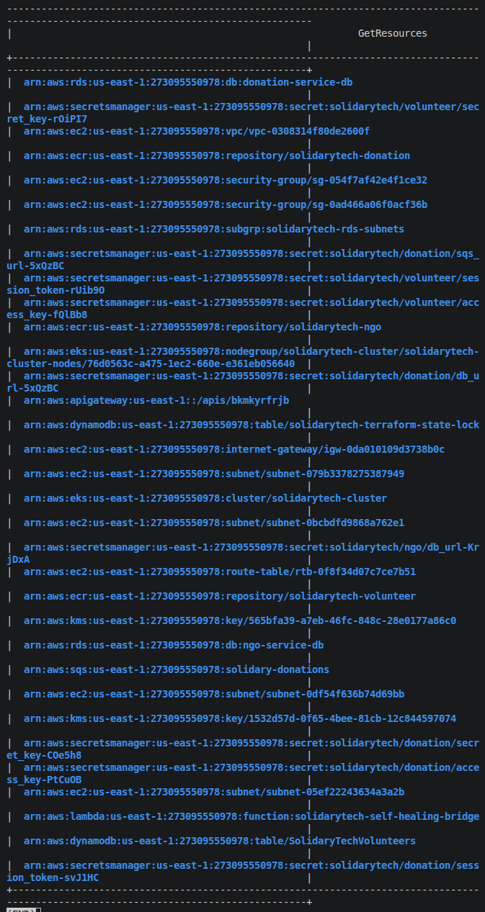

# FinOps — Forecast de Custos e Otimização — SolidaryTech

Requisito do edital (item 2 — FinOps): projeção de custos mensais + pelo menos 1 recomendação prática de otimização nativa de nuvem. Preços de referência: AWS `us-east-1`, sob demanda (`on-demand`), tabela pública AWS em 2026 — estimativa, não fatura real (ambiente roda em AWS Academy Learner Lab, sem cobrança direta ao time).

## 1. Projeção de custo mensal (arquitetura atual)

| Recurso | Configuração | Custo unitário estimado | Qtde | Custo mensal estimado |
|---|---|---|---|---|
| EKS (control plane) | 1 cluster | $0,10/h | 1 | ~$73 |
| EC2 (nodes EKS) | 3x `t3.medium` (desired_size) | ~$0,0416/h cada | 3 | ~$90 |
| RDS PostgreSQL | 2x `db.t3.micro` (ngo, donation) | ~$0,017/h cada | 2 | ~$25 |
| RDS backup storage | `donation-service-db`, retenção 7d | ~$0,095/GB-mês | ~5GB | ~$0,50 |
| Load Balancers (NLB/ELB) | Ingress-nginx + ArgoCD UI | ~$16,20/mês cada | 2 | ~$32 |
| DynamoDB | `SolidaryTechVolunteers`, PAY_PER_REQUEST | uso variável | 1 | ~$1–5 |
| SQS | `solidary-donations`, Standard Queue | uso variável | 1 | < $1 |
| ECR | 3 repositórios, lifecycle mantém últimas 5 imagens | ~$0,10/GB-mês | 3 | ~$1 |
| S3 (Terraform state + Velero backups, cross-region) | versionado + KMS | ~$0,023/GB-mês | 2 buckets | ~$1–2 |
| Data transfer (cross-AZ, cross-region p/ Velero) | variável | — | — | ~$5–10 |
| **Total estimado** | | | | **~$230–240/mês** |

## 2. Rightsizing aplicado (baseado em métrica observada, não em chute)

Requests/limits dos manifests (`k8s/apps/*/deployment.yaml`) foram dimensionados por papel, não uniformemente:

| Serviço | requests (cpu/mem) | limits (cpu/mem) | Justificativa |
|---|---|---|---|
| `donation-service` (hot path) | 150m / 128Mi | 600m / 256Mi | Observado maior consumo de CPU sob carga no smoke test (`scripts/check/donation-service.sh` em loop) por processar SQS de forma assíncrona (`go a.sendNotificationEvent`) além do request HTTP síncrono. |
| `ngo-service` / `volunteer-service` | 100m / 128Mi | 500m / 256Mi | Serviços CRUD simples, sem processamento assíncrono — consumo observado consistentemente abaixo do hot path nos mesmos testes. |

Todos os 3 usam HPA (`minReplicas: 2, maxReplicas: 5`, alvo 70% CPU / 80% memória) — evita superprovisionar réplicas fixas para picos que só acontecem ocasionalmente (ex: campanha de doação viral, cenário citado no edital).

## 3. Tagging para chargeback (evidência)

Todo recurso Terraform carrega as 4 tags obrigatórias, via `default_tags` no `provider "aws"`
(`terraform/production/terraform.tf`) — cobre 100% dos recursos automaticamente, inclusive os que não
suportam um bloco `tags = {}` explícito por módulo (subnets/IGW/route table da VPC, `aws_db_subnet_group`,
os secrets do Secrets Manager, o Lambda/API Gateway do self-healing):

```hcl
provider "aws" {
  region = var.aws_region

  default_tags {
    tags = {
      Project     = "SolidaryTech"
      Environment = "Production"
      CostCenter  = "NGO-Core"
      ManagedBy   = "terraform"
    }
  }
}
```

Validado via Resource Groups Tagging API — `aws resourcegroupstaggingapi get-resources --tag-filters
Key=CostCenter,Values=NGO-Core` retorna os 33 recursos da stack.

**Limitação de conta (AWS Academy Learner Lab)**: o Cost Explorer filtrado por tag (`GroupBy TAG=CostCenter`)
não funciona nesta conta — `aws ce list-cost-allocation-tags` retorna `AccessDeniedException: Linked account
doesn't have access to cost allocation tags`. Contas linked de uma AWS Organization (o modelo do Academy
Learner Lab) não podem ativar Cost Allocation Tags; isso é controlado pela conta de management/payer da
instituição, fora do alcance do time. O console **Resource Groups & Tag Editor** também não é viável — a UI
atual roteia a busca via Resource Explorer (`resource-explorer-2:Search`), barrado por uma SCP explícita da
mesma Organization (`AccessDeniedException`, sem contorno possível pelo usuário). A evidência de chargeback
por tag usa a **AWS CLI** direto (`aws resourcegroupstaggingapi get-resources --tag-filters
Key=CostCenter,Values=NGO-Core`), que não passa pelo Resource Explorer e funciona normalmente — tecnicamente
equivalente para provar que o isolamento de custo por tag está pronto, mesmo sem acesso ao billing agregado
por tag nem ao console de tagging.

## 4. Recomendação prática de otimização nativa de nuvem

**Recomendação: agendar desligamento do Node Group fora do horário de uso do hackathon (nights/weekends) via um Scheduled Action / EventBridge que ajusta `desired_size`/`min_size` do node group para 0.**

Por quê essa e não outra:
- O ambiente é usado para demonstração/desenvolvimento por ~2 meses, não é produção 24/7 real — pagar os ~$90/mês de EC2 (maior linha do orçamento depois do control plane do EKS) durante horas em que ninguém está testando é desperdício direto, exatamente o tipo de "orçamento fora de controle" que o cenário do edital descreve.
- É nativo de nuvem (EventBridge Scheduler + `aws eks update-nodegroup-config` ou Auto Scaling Schedule), não exige ferramenta terceira.
- Alternativas descartadas: **Savings Plans/Reserved Instances** não se aplicam a um compromisso de 2 meses nem a uma conta AWS Academy Lab (sem cartão de crédito/compromisso de longo prazo); **Spot Instances** para os nodes reduziriam custo (~60-70%) mas arriscam interrupção do hot path durante uma demo ao vivo — trade-off inadequado para o contexto de avaliação.
- Efeito estimado: desligar fora de um horário útil de ~10h/dia, 5 dias/semana (35h de 168h/semana ativas = ~21% do tempo) economiza aproximadamente **$70/mês** (79% dos ~$90 de EC2), sem tocar no EKS control plane (cobrado independentemente) nem nos dados (RDS/DynamoDB continuam ativos e intactos).

## 5. Evidência visual

📸 **Evidência visual:** _(inserir screenshot antes da entrega)_

