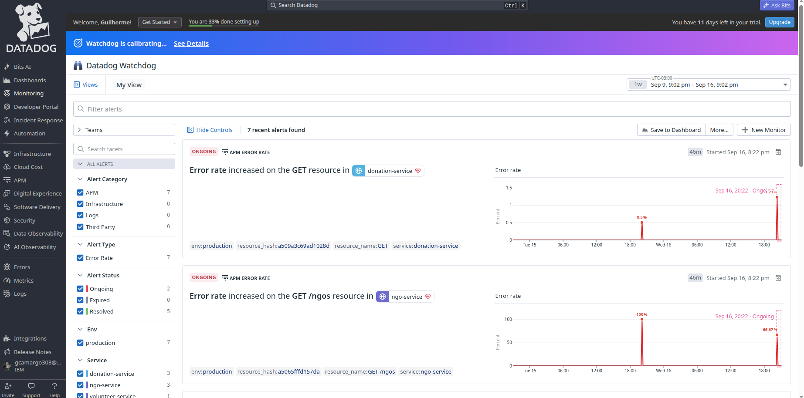
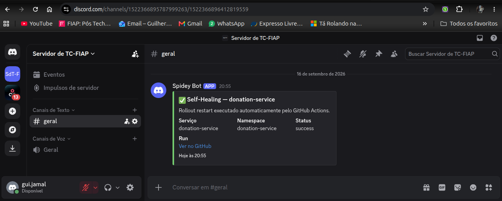
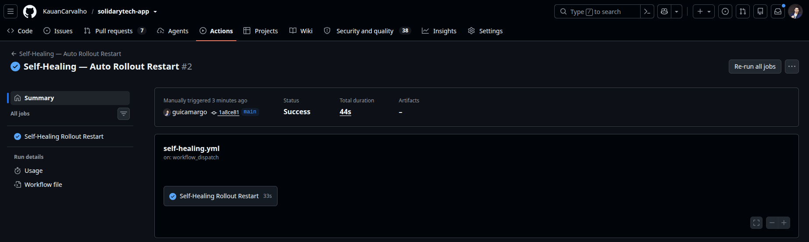

# Ciclo de Vida de Incidentes — SolidaryTech (ITSM/AIOps)

Requisito do edital (item 3 — ITSM e AIOps): desenhar o fluxo de vida de um incidente, da detecção via AIOps/alerta até o Post-Mortem e comunicação aos stakeholders.

O SLA de 99.5%/mês citado na etapa 7 abaixo é o compromisso formal definido em `docs/sla.md` (créditos por nível de violação, exclusões e cadência de relatório) — este documento cobre o fluxo operacional do incidente; o `docs/sla.md` cobre a obrigação contratual em si.

## Diagrama do fluxo

```
┌─────────────────┐     ┌──────────────────┐     ┌───────────────────┐
│   1. DETECÇÃO    │────▶│    2. ALERTA      │────▶│    3. TRIAGEM      │
│                  │     │                    │     │                    │
│ • Prometheus     │     │ • AlertManager     │     │ • On-call avalia   │
│   (PrometheusRule│     │   roteia p/ 3      │     │   severidade e     │
│   solidarytech-  │     │   canais:          │     │   escopo           │
│   alerts)        │     │   - Discord        │     │ • Datadog Watchdog │
│ • Datadog        │     │     (ChatOps)      │     │   sugere anomalias │
│   Watchdog       │     │   - PagerDuty      │     │   correlacionadas  │
│   (AIOps —       │     │     (incidente     │     │   (ex: deploy      │
│   detecção       │     │     formal)        │     │   recente + pico   │
│   preditiva de   │     │   - Self-healing   │     │   de erro)         │
│   anomalia, não  │     │     (automação)    │     │                    │
│   apenas limiar) │     │                    │     │                    │
└─────────────────┘     └──────────────────┘     └─────────┬─────────┘
                                                              │
                    ┌─────────────────────────────────────────┤
                    │                                          │
                    ▼                                          ▼
        ┌───────────────────────┐                ┌───────────────────────┐
        │  4a. SELF-HEALING      │                │  4b. INTERVENÇÃO      │
        │      (automático)      │                │      MANUAL           │
        │                        │                │                        │
        │ • Alertas de           │                │ • Quando self-healing  │
        │   disponibilidade/     │                │   não resolve (ex:     │
        │   latência do          │                │   bug de código,       │
        │   donation-service     │                │   problema de dados)   │
        │   disparam webhook     │                │ • On-call investiga    │
        │   → Lambda →           │                │   via Datadog APM      │
        │   repository_dispatch  │                │   (traces) + Grafana   │
        │ • GitHub Actions       │                │   (dashboard SRE)      │
        │   (self-healing.yml)   │                │ • Rollback via GitOps  │
        │   roda kubectl rollout │                │   (revert commit no    │
        │   restart no           │                │   repo gitops, ArgoCD  │
        │   deployment afetado   │                │   sincroniza)          │
        └───────────┬───────────┘                └───────────┬───────────┘
                    │                                          │
                    └────────────────────┬─────────────────────┘
                                          ▼
                              ┌───────────────────────┐
                              │    5. RESOLUÇÃO        │
                              │                        │
                              │ • Alerta muda de       │
                              │   "firing" p/          │
                              │   "resolved"           │
                              │   (AlertManager)        │
                              │ • Notificação de        │
                              │   resolução no          │
                              │   Discord/PagerDuty     │
                              │ • Confirmação via        │
                              │   dashboard SRE          │
                              │   (SLI voltou ao alvo)   │
                              └───────────┬───────────┘
                                          ▼
                              ┌───────────────────────┐
                              │   6. POST-MORTEM       │
                              │                        │
                              │ • Obrigatório para      │
                              │   severidade            │
                              │   critical/warning       │
                              │   sustentado             │
                              │ • Timeline (traces +     │
                              │   logs correlacionados   │
                              │   no Datadog/Loki)       │
                              │ • Causa raiz + ação       │
                              │   corretiva               │
                              │ • Impacto no Error        │
                              │   Budget (quanto do        │
                              │   SLO mensal foi           │
                              │   consumido)                │
                              └───────────┬───────────┘
                                          ▼
                              ┌───────────────────────┐
                              │ 7. COMUNICAÇÃO AOS     │
                              │    STAKEHOLDERS         │
                              │                        │
                              │ • ONGs parceiras:        │
                              │   se SLA violado          │
                              │   (< 99.5%/mês),           │
                              │   comunicação formal        │
                              │   + créditos conforme        │
                              │   contrato                    │
                              │ • Diretoria SolidaryTech:      │
                              │   resumo executivo do          │
                              │   post-mortem                   │
                              └───────────────────────┘
```

## Mapeamento SLI/SLO/SLA → ação

| Situação | SLI/SLO envolvido | Canal | Automação |
|---|---|---|---|
| Erro 5xx > 5% por 2min | Disponibilidade (limiar operacional) | Discord + PagerDuty + self-healing | `DonationServiceHighErrorRate` |
| Burn-rate rápido (14.4x) | Error Budget do SLO 99.9% | Discord + PagerDuty + self-healing | `DonationServiceSLOBurnRateFast` |
| Burn-rate lento (6x, 1h) | Error Budget do SLO 99.9% | Discord + PagerDuty | `DonationServiceSLOBurnRateSlow` (sem self-healing — degradação lenta pede investigação, não restart automático) |
| < 95% das requisições < 300ms | SLI de Latência | Discord + PagerDuty | `DonationServiceLatencySLOViolation` |
| 0 pods disponíveis em qualquer serviço | Disponibilidade | Discord + PagerDuty + self-healing | `ServiceUnavailable` |
| Anomalia comportamental (sem limiar fixo) | N/A — preditivo | Datadog Watchdog → investigação manual | Não aciona self-healing automaticamente (evita reagir a falso positivo de ML sem revisão humana) |

## Por que essa separação self-healing vs manual

Self-healing (`kubectl rollout restart`) resolve a classe de incidente mais comum em produção — um pod travado/degradado que um restart resolve — sem esperar por um humano. Mas **não é acionado** para o burn-rate lento nem para anomalias do Watchdog: um restart não corrige um bug de lógica ou uma anomalia de padrão de uso, e disparar restarts automáticos nesses casos mascararia o problema real sem resolvê-lo, adiando a detecção da causa raiz.

## Evidência visual

📸 **Evidência visual:** _(inserir screenshot antes da entrega)_

| Evidência | Imagem |
|---|---|
| Datadog Watchdog detectando anomalia de error rate automaticamente (AIOps) |  |
| Notificação de alerta/resolução no Discord |  |
| Execução do `self-healing.yml` no GitHub Actions (rollout restart automático) |  |
